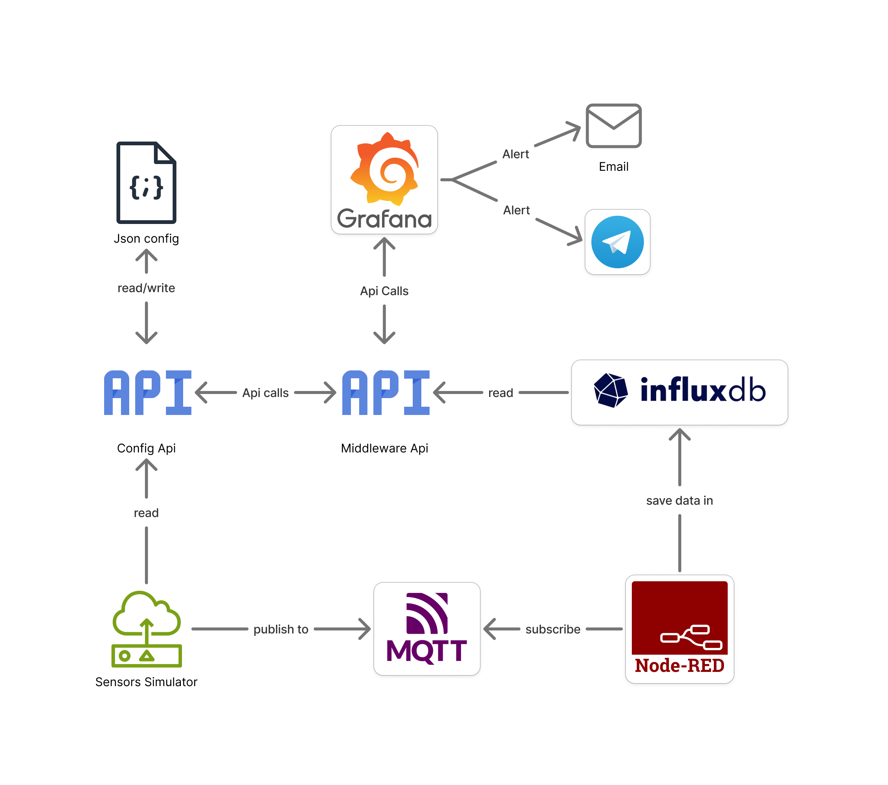

# Smart Bus System

Team Members:
- Giacomo Paolocci
- Raffaele Lorusso

## Introduction

Smart Bus System is an IoT project that simulates a fleet of buses and bus stops in a city, streams telemetry through MQTT, processes it with Node-RED, stores it in InfluxDB, and exposes dashboards and controls in Grafana.

The goal is to provide both:
- Real-time monitoring of buses and stops
- Operational controls to add/remove buses and stops from a web dashboard
- Alerting for critical transport events

## System Description

The system is composed of independent Dockerized services connected through a private Docker network:

- **Sensors Simulator**: generates dynamic telemetry for buses and stops.
- **Mosquitto (MQTT broker)**: receives sensor messages on structured topics.
- **Node-RED**: ingests MQTT streams, normalizes data, and writes points to InfluxDB.
- **InfluxDB**: stores time-series telemetry.
- **Config API**: reads/writes the static JSON configuration (city parameters, buses, stops).
- **Grafana Middleware API**: merges static configuration and latest telemetry for dashboard usage.
- **Grafana**: provides dashboards, forms, and alerting channels (email and Telegram).

## Functional Requirements

- Simulate bus and stop telemetry values continuously.
- Publish telemetry using MQTT topics grouped by entity and sensor type.
- Persist historical time-series data in InfluxDB.
- Provide REST endpoints to:
  - Read full system configuration
  - Add and delete buses
  - Add and delete stops
  - Update city simulation parameters
- Aggregate static and live data for frontend/dashboard consumption.
- Visualize transport state through dedicated Grafana dashboards.
- Allow management operations (add/remove buses and stops) from Grafana forms.
- Trigger alerts when:
  - A bus is near maximum capacity
  - A bus reports a failure status


## Non functional Requirements

- **Containerized deployment**: all services run via Docker Compose.
- **Configurability**: credentials and network parameters are externalized in `.env`.
- **Modularity**: each concern (simulation, broker, ingestion, storage, visualization) is isolated in a dedicated service.
- **Interoperability**: communication uses standard protocols and formats (HTTP/REST, MQTT, JSON).
- **Extensibility**: buses/stops can be changed at runtime through API and dashboards.
- **Observability**: dashboards and alerts provide operational visibility.


## System Architecture

### High-level data flow and components

The arrow direction indicate how the flow is directed, for example, `Middleware Api` read datas from `Influxdb`

```
Sensors --> MQTT --> Node-RED --> InfluxDB
  /\                                 ||
  ||                                 ||
  \/                                 \/
Config API <------------------> Middleware API <--> Grafana
```



### Components and responsibilities

#### Config API
>Technology used: Python, Flask, JSON file persistence.

Python Flask service exposing endpoints to read and modify the JSON configuration.

Main endpoints:
- `GET /config`
- `GET /getBuses`
- `POST /addBus`
- `DELETE /deleteBus`
- `GET /getStops`
- `POST /addStop`
- `DELETE /deleteStop`
- `POST /updateCityParams`

Used by:
- Sensors simulator (to reload dynamic configuration)
- Middleware API (to combine static entities with live metrics)

---

#### Sensors Simulator

> Technology used: Python MQTT publish messaging with paho client.

- Simulates values for buses and stops.
- Sends values to MQTT topics.


Bus sensors publish:
- Bus status
- Bus current stop
- People inside the bus

Stop sensors publish:
- Rain
- Temperature
- People waiting for the bus

```py
# Topics
BUS = "bus"
STOP = "stop"

# Sensor types for stops
TEMP = "temp"
RAIN = "rain"
PEOPLE = "people"  # People waiting for the bus

# Sensor types for buses
CURRENT_STOP = "current_stop"
CURRENT_CAPACITY = "current_capacity"  # People inside the bus
STATUS = "status"
```

Topics structure:
- `stop/{stop_id}/{sensor_type}`
- `bus/{bus_id}/{sensor_type}`

---

#### Mosquitto

>Technology used: Eclipse Mosquitto MQTT broker.

Mosquitto hosts the MQTT broker and enforces authentication through:
- `mosquitto/config/mosquitto.conf`
- `password_file /mosquitto/config/mosquitto.passwd`


The password file is generated at image build time:

```Dockerfile
RUN mosquitto_passwd -b -c /mosquitto/config/mosquitto.passwd $IOT_USERNAME $IOT_PASSWORD
```
---

#### Node-RED
Node-RED acts as ingestion and transformation layer.

Environment variables:
- `MQTT_USERNAME`
- `MQTT_PASSWORD`
- `INFLUX_TOKEN`

Role:
- Subscribe to MQTT topics
- Aggregate bus and stop payloads
- Write normalized records to InfluxDB

---

#### InfluxDB
Telemetry is stored in bucket `smart`.

Logical structure:
```
smart (bucket)
|
|---autobus
|   |---B1
|   |   |--- current_capacity
|   |   |--- current_stop
|   |   \--- status
|   |---B2
|   |   \--- ...
|   \--- ...
\---busStop
    |---Stop1
    |   |--- people
    |   |--- rain
    |   \--- temp
    |---Stop2
    |   \--- ...
    \--- ...
```

---

#### Middleware API

>Technology used: Python, Flask, InfluxDB Python client, HTTP REST integration

The Middleware API is a Flask service that acts as an orchestration layer between Grafana, Config API, and InfluxDB.

It is designed to keep Grafana simple: dashboards call one REST layer that already contains both static metadata (from configuration) and live telemetry (from time-series storage).

Main responsibilities:
- Proxy management operations from Grafana to Config API (`add/delete` for buses and stops).
- Read static entities from Config API (`buses`, `stops`, routes, capacities, coordinates).
- Query InfluxDB for the latest values of each sensor field.
- Merge static and dynamic data into a dashboard-ready JSON structure.

Exposed endpoints:
- `GET /getBuses`: returns buses enriched with last known telemetry.
- `POST /addBus`: forwards payload to Config API.
- `DELETE /deleteBus`: forwards payload to Config API.
- `GET /getStops`: returns stops enriched with last known telemetry.
- `POST /addStop`: forwards payload to Config API.
- `DELETE /deleteStop`: forwards payload to Config API.

Data enrichment behavior:
- For each bus, the middleware joins:
  - Static fields: `id`, `capacity`, `route`
  - Live fields: `people` (`current_capacity`), `status`, `current_stop`
  - Derived map fields: `lat`, `lon` (resolved from the current stop)
- For each stop, the middleware joins:
  - Static fields: `id`, `name`, `lat`, `lon`
  - Live fields: `people`, `rain`, `temp`

What this layer do:
- Decouples Grafana from direct database and multi-service logic.
- Centralizes the integration logic in one service.

---

#### Grafana
Grafana is used for dashboards, forms, and alerting.

Dashboards:
- **Buses Dashboard**: bus-specific monitoring and management.
- **Stops Dashboard**: stop-specific monitoring and management.
- **Data and General Dashboard**: global overview with map, aggregated indicators, tables, and alert views.

Used plugins:
- **yesoreyeram-infinity-datasource**: REST integration with middleware API.
- **volkovlabs-form-panel**: forms to add/delete buses and stops.

## Docker Configuration

### Initial configuration

At first run, create a `.env` file in the same directory as `docker-compose.yml` (inside `smart-bus-system`).

This file centralizes credentials and network parameters used by all services.

Example:

```env
IOT_USERNAME = "admin"
IOT_PASSWORD = "admin123" # needs to be longer than 5 characters in order for influxdb to work correctly
INFLUX_TOKEN = "apjbchV0DxiMqyLFGxZPrNe1BtsRCKyfrAKGWjG5tngI0LwvCsKPMrL7UNZxLtliljCvHqJaueMMqULQ7yt1Zw==" #(for the database)
NETWORK = "21.0.0"#.0 (for the network in which the compose is declared)
MAIL_KEY="xxx.xxx.xxx.xxx" #(for the mailing service )
MAIL_LOGIN = "xxx@xxx.xxx.xxx"
```

### Run the stack

From `smart-bus-system` directory:

```bash
docker compose up --build
```

Main exposed ports:
- `1883` Mosquitto (MQTT)
- `1880` Node-RED
- `8086` InfluxDB
- `3000` Grafana
- `5001` Config API
- `5000` Middleware API


### Config file
A configuration JSON file is required for the simulator and for runtime management operations.

Current location in this repository:
- `smart-bus-system/config-api/config.json`

Structure:

```json
{
  "city_params": {
    "rain_factor": 1.2, // likelihood of rain at stops, range from 0 to 10
    "global_temp": 22 // general baseline temperature of the cityscape in the simulation
  },
  "buses": [ // JSON-array of buses
    {
      "id": "B1", // UNIQUE identifier and name
      "route": [ // list of IDs of stops in order of travel (when arrived at last stop, it loops)
        "Stop4",
        "Stop2",
        "Stop3"
      ],
      "capacity": 50 // amount of people the bus can handle
    }, ...
    
  ],
  "stops": [ // JSON-array of stops
    {
      "id": "Stop1", // UNIQUE identifier
      "lat": 42.36778027625135, // latitude of the geographical position of the stop
      "lon": 13.352363241348343, // longitude of the geographical position of the stop
      "name": "Coppito" // name of the stop, no restrictions, it's used to identify the stop from the dashboards
    }, ...
  ]
}
```

Field notes:
- `city_params.rain_factor`: controls how likely rain appears in simulation.
- `city_params.global_temp`: baseline temperature used by temperature generation.
- `buses[].route`: ordered list of stop IDs; when the last stop is reached, route loops from the first.
- `buses[].capacity`: max passenger capacity used by simulation and alerts.


## Alerting System

Alerting is implemented with Grafana alert rules and notification channels (email and Telegram).

Current alert cases:
- Bus occupancy near maximum capacity.
- Bus status reports a failure.

Notifications are sent to configured recipients using Grafana contact points.